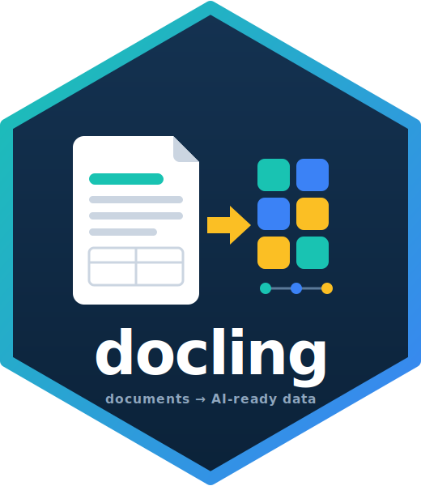
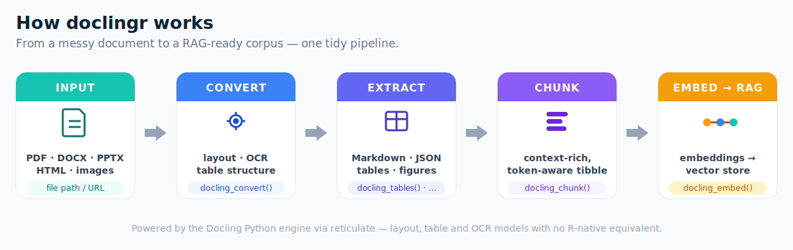

# doclingr 

> Document intelligence for R — turn messy PDFs, Office files and HTML into
> AI-ready, structured data.


**doclingr** is an R interface to [Docling](https://github.com/docling-project/docling),
an open-source document-understanding library. It brings layout-aware PDF/DOCX/PPTX/HTML
parsing, table extraction, OCR and RAG-ready chunking to R, exposing it through a
small, tidy-friendly API built on [reticulate](https://rstudio.github.io/reticulate/).

R already has `pdftools`, `tabulizer`, `officer`, `readtext` and friends, but no
single "document intelligence for RAG" package. doclingr aims to fill that gap:
take a document, understand its layout, extract its tables, preserve its
structure, chunk it, and hand it back ready for search and embeddings.

## How it works

<p align="center">
   convert -> extract -> chunk -> embed" />
</p>

## Installation

```r
# install.packages("pak")
pak::pak("StrategicProjects/doclingr")
```

doclingr talks to the Docling Python package via reticulate. Install the backend
once:

```r
library(doclingr)
install_docling()      # creates an "r-docling" Python environment
# restart R
docling_available()    # TRUE
```

## Usage

```r
library(doclingr)

doc <- docling_convert("https://arxiv.org/pdf/2408.09869")

# Export
as_markdown(doc)       # layout-aware Markdown
as_json(doc)           # structured DoclingDocument as an R list

# Pages and tables
docling_n_pages(doc)
tables <- docling_tables(doc)   # list of tibbles
tables[[1]]

# Figures -> tibble (captions, pages, optional saved images)
doc <- docling_convert("paper.pdf", images = TRUE)
docling_figures(doc, image_dir = "figures")

# RAG-ready chunks -> tibble
chunks <- docling_chunk(doc, max_tokens = 512)
chunks$text[1]

# Match your embedding model's tokenizer for accurate budgets
chunks <- docling_chunk(doc, tokenizer = "BAAI/bge-small-en-v1.5", max_tokens = 512)
```

### From chunks to embeddings

doclingr stays provider-agnostic: bring any embedding function (an API call, a
local model via reticulate, ...) and `docling_embed()` handles batching and tidy
assembly into an `embedding` list-column.

```r
embed_openai <- function(txt) {
  # your call to an embeddings API -> matrix (one row per text)
}

doc |>
  docling_chunk(max_tokens = 512) |>
  docling_embed(embed_openai, batch_size = 64)
#> # adds `embedding` (list-column) and `n_dim` columns
```

## Why Docling, why reticulate?

Docling's quality comes from deep-learning models (layout analysis, the
TableFormer table-structure model, OCR). Those have no R-native equivalent, so
doclingr binds the maintained Python implementation rather than reimplementing
it — the same strategy used by `tensorflow`, `keras` and `spacyr`. You get
upstream parity for free; doclingr focuses on an idiomatic, tidy R surface.

## Status

Experimental and under active development. API may change. Contributions and
issues welcome at <https://github.com/StrategicProjects/doclingr>.

## License

MIT © André Leite
